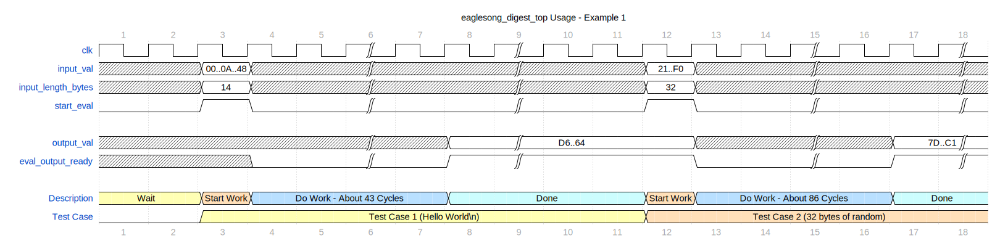

# Eaglesong Verilog Specification

<!-- Render to PDF with: `pandoc --number-sections --shift-heading-level-by=-1 SPECIFICATION.md -o eaglesong-verilog-spec.pdf` -->

This document is best viewed online at:

> [https://github.com/DeflateAwning/eaglesong-verilog/blob/implement1/SPECIFICATION.md](https://github.com/DeflateAwning/eaglesong-verilog/blob/implement1/SPECIFICATION.md)

## Algorithm Specification

The Eaglesong hash algorithm/function is defined and implemented in the
[Nervos Network's Request for Comments repo](https://github.com/nervosnetwork/rfcs).
[RFC 0010](https://github.com/nervosnetwork/rfcs/tree/master/rfcs/0010-eaglesong) defines the Eaglesong
hash algorithm.

Eaglesong is a marketed as a cryptographic hash algorithm, but has limited use in actual cryptographic applications.
In security-critical applications, its applicability should be further evaluated.

## Warnings and Limitations

This project was created as a school assignment. It should not be used in any security-critical applications without
further validation. Its correctness is not guaranteed.

## Errata and Known Issues

None, currently.

## Port Descriptions

The `eaglesong_digest_top` module, defined in `src/rtc/eaglesong_digest_top.sv`, is the top-level device intended to be
interacted with from outside. As the IO ports are quite wide, the design likely will need to be encapsulated into a
serial-to-parallel converter (not included within this project).

All ports are fixed-width (i.e., no ports are of parameterized length currently).

| Port Name            | Port Width (bits) | Direction | Description                                                                                                                                                                                 |
| -------------------- | ----------------- | --------- | ------------------------------------------------------------------------------------------------------------------------------------------------------------------------------------------- |
| `clk`                | 1                 | input     | Clock input signal. Actions happen on rising clock edges only.                                                                                                                              |
| `input_val`          | 256               | input     | Input data (up to 32 bytes). Bit 0 is on the right side (i.e., `[255:0]`)                                                                                                                   |
| `input_length_bytes` | 7                 | input     | Number of bits in `input_val` to be used. Allowable range: `1 <= input_length_bytes <= 32`. Only the first `input_length_bytes*8` bits are used from `input_val`, and the rest are ignored. |
| `start_eval`         | 1                 | input     | Set high for one `clk` rising edge to store the `input_val` and `input_length_bytes` values. After one clock cycle, set to low to complete the calculation.                                 |
| `output_val`         | 256               | output    | Output digest value of the input. Little-endian (i.e., `[255:0]`). Value should not be used when `eval_output_ready` is low.                                                                |
| `eval_output_ready`  | 1                 | output    | When this value is set to high, the calculation is complete and the `output_val` is considered valid.                                                                                       |

## Parameter Descriptions

There are currently no parameters in this design. All parameters are hard-coded.

The following are parameters which _could_ be changed in the future, should parameterization be considered valuable:

1. num_rounds = 43
2. capacity = 256
    - must be multiple of 32
3. rate = 256
    - must be multiple of 32
4. output_length = 32 bytes (256 bits)
5. delimiter = 0x06
    - delimiter between sponge rounds
6. coefficients, bitmatrix, injection_constants: fixed values from the specification

## Theory of Operation

The `eaglesong_digest_top` module processes input data to generate a cryptographic hash using the Eaglesong algorithm.
This section outlines the key aspects of its operation.

### Example Timing Diagram



### Data Flow

Input data is provided through the `input_val` port, along with the corresponding `input_length_bytes` specifying the
number of bits to be considered from `input_val`. Only bits `[input_length_bytes*8 : 0]` from `input_val` are used; the
rest are ignored.

Upon receiving a high signal on `start_eval` on a rising clock edge, the module stores the values on `input_val` and
`input_length_bytes` to internal registers. Upon `start_eval` subsequently being low again on a rising clock edge, it
begins processing the input data.

The input data is absorbed into the internal state through absorption and permutation stages.

After computation, the resulting hash value is available in `output_val`.

### Output Generation

The hash value is stored in `output_val`, provided that `eval_output_ready` is high, indicating the completion of the
computation.

Execution takes about 43 clock cycles for `input_length <= 31`, and 86 clock cycles for `input_length >= 32`.

### Synchronous Operation

The module operates synchronously with the clock signal (`clk`). Actions occur only on rising clock edges.

### Error Handling

The module does not include explicit error handling mechanisms. Users should ensure that the input parameters
(`input_val`, `input_length_bytes`) are within the allowable ranges and that the `start_eval` signal is properly
managed.

### Usage

To use the `eaglesong_digest_top` module, instantiate it within the design. Provide valid input data through `input_val`
and `input_length_bytes`. Set `start_eval` high for one clock cycle to initiate the hash computation. Wait for
`eval_output_ready` to become high, indicating that the hash calculation is complete.

Retrieve the resulting hash value from `output_val`. Users should follow these guidelines to effectively integrate the
`eaglesong_digest_top` module into their designs for cryptographic hash generation.

Due to the wide input and output ports (32 bytes each), users may opt to wrap the `eaglesong_digest_top` module in a
serial-to-parallel converter.

## System Architecture

The overall block instantiation pattern of nesting is as follows:

-   `eaglesong_digest_top`
    -   `eaglesong_absorb_comb`
    -   `eaglesong_all_permutations`
        -   `eaglesong_permutation`

The top level `eaglesong_digest_top` module instantiates a `eaglesong_absorb_comb` combinational block (named `absorb`),
and a `eaglesong_all_permutations` sequential block (named `perms`). The `eaglesong_all_permutations` sequential block
instantiates a `eaglesong_permutation` combinational block (named `perm`).

## Simulation

### Tests

Tests are implemented for all sub-blocks (`eaglesong_absorb_comb`, `eaglesong_all_permutations`,
`eaglesong_permutation`) via SystemVerilog test benches, runnable in IVerilog. Test cases are created using the
reference model's intermediate debug print statements, which dump out internal states.

Top-level tests for `eaglesong_digest_top` are created using Verilator. Similarly, the test cases are generated using
the reference model.

### Running Simulations

The sub-block test benches can be run in IVerilog using the `src/run_iverilog_tests.sh` script:

```bash
./src/run_iverilog_tests.sh
```

The top-level tests in Verilator can be run using the `src/tb_verilator/run_verilator_tests.sh` script:

```bash
./src/tb_verilator/run_verilator_tests.sh
```

Both tests display a total success/failure rate at the end of execution.

## Synthesis

This design is likely not synthesizable.

If it were, this section would comment on the following aspects:

1. Area
2. Timing Info/Frequency Capabilities
3. Multi-cycle Paths

In order to make this design synthesizable, more consideration should be put into the following aspects:

1. Limit the number of lookup tables, especially as related to the `injection_constants` storage.
2. Verify timing constraints.
3. Verify the initial values of the top-level system.

## Next Steps for Optimization

1. Improve pipelining for higher throughput, especially within the `eaglesong_permutation` combinational block.
2. More test cases.
3. Automated testing in this repo with GitHub Actions.
